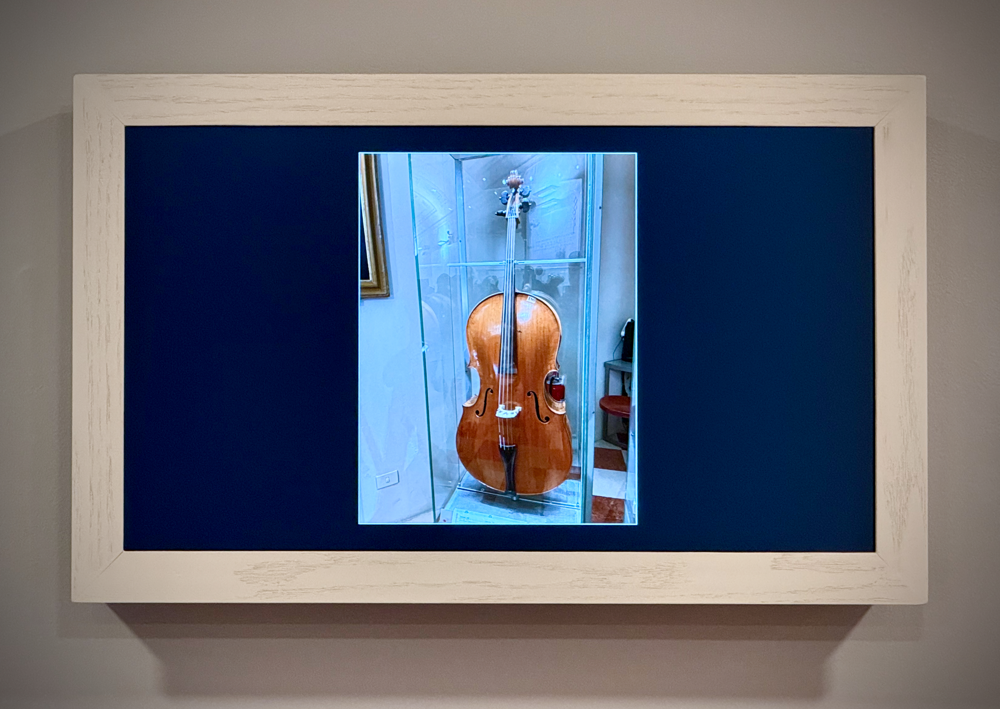
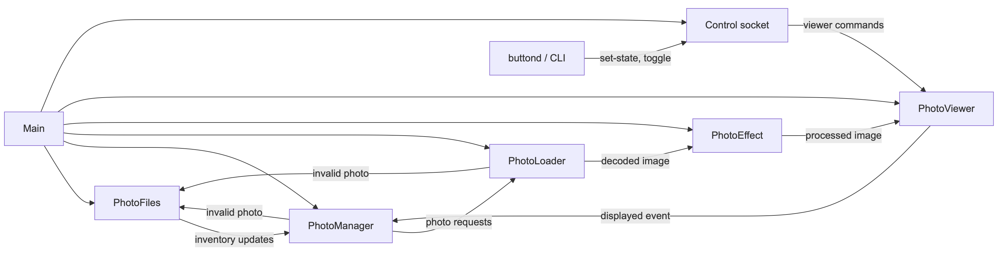
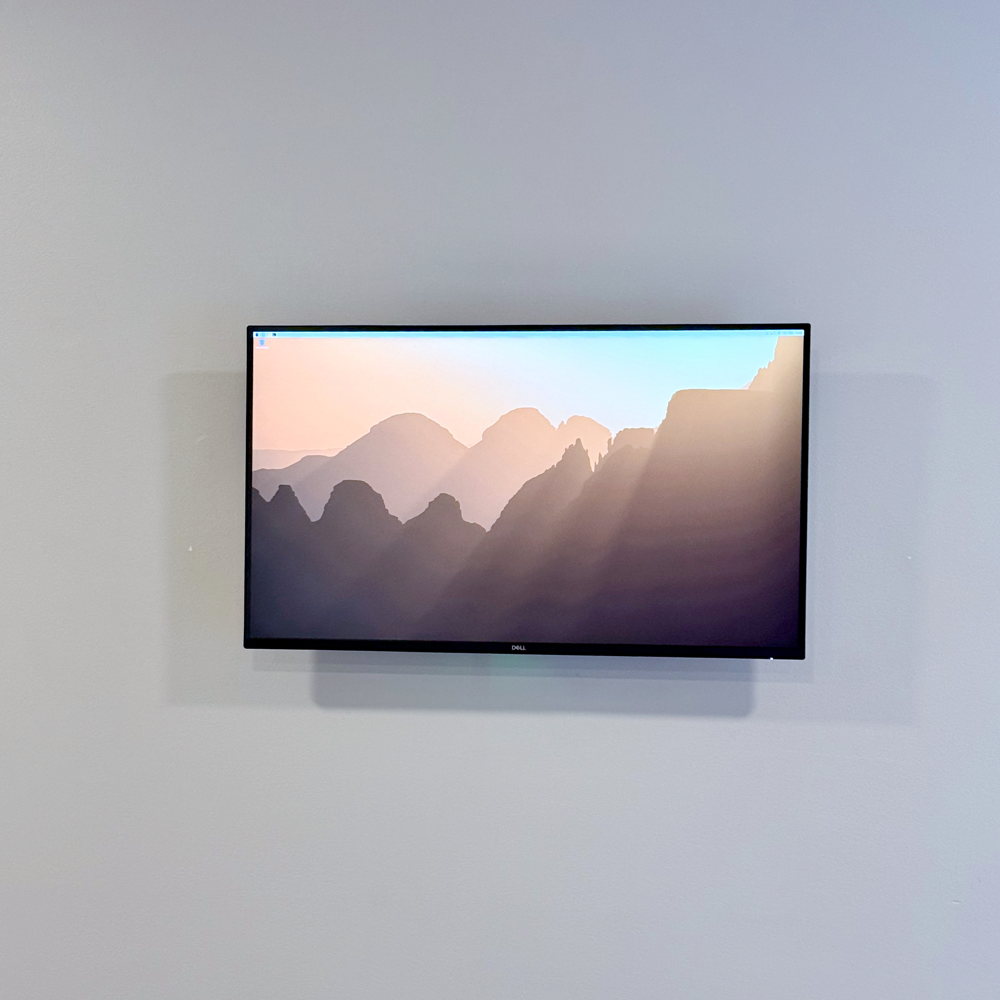
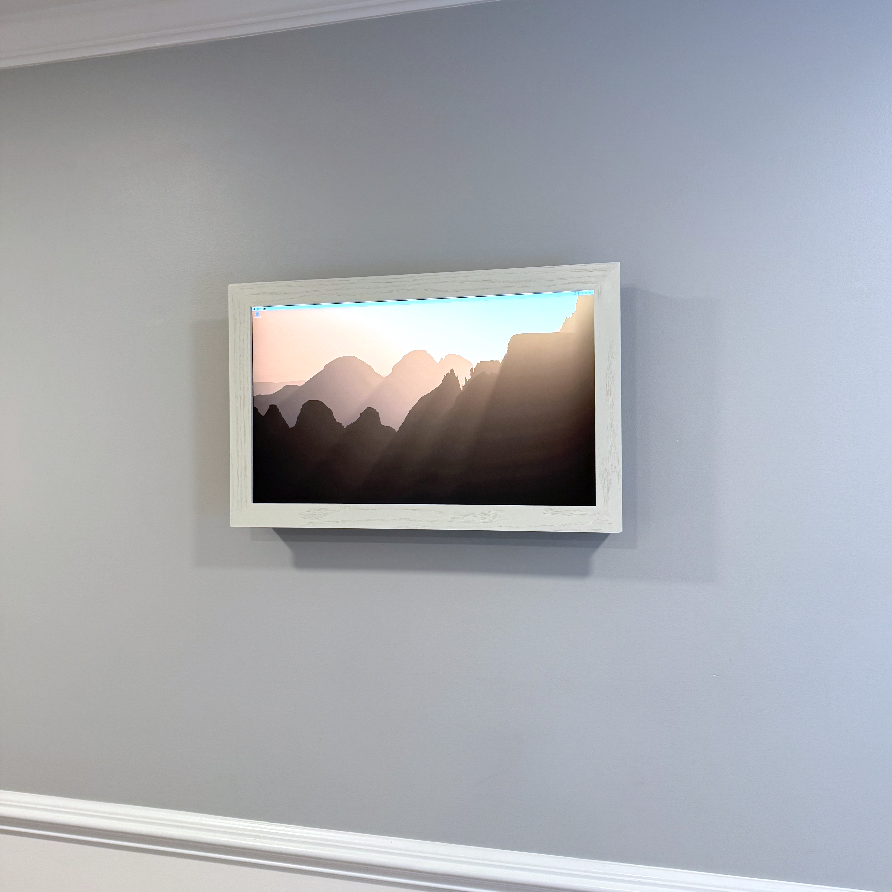
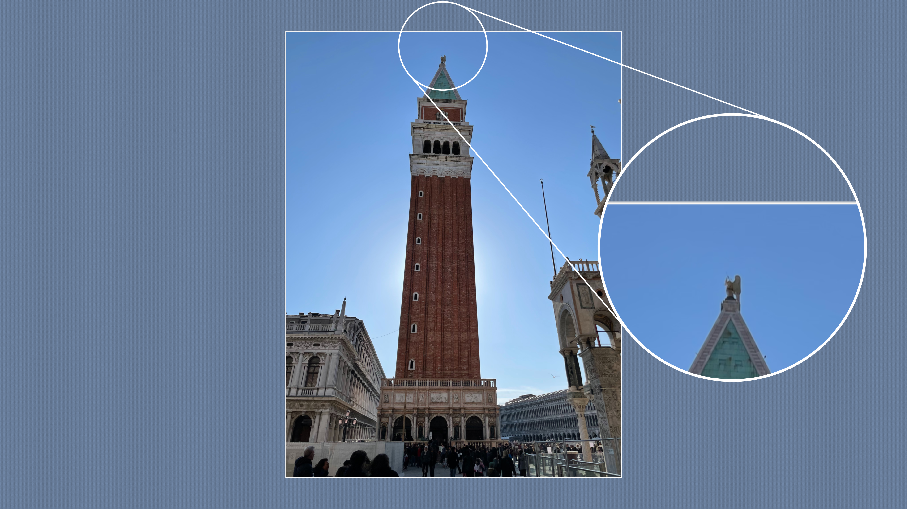
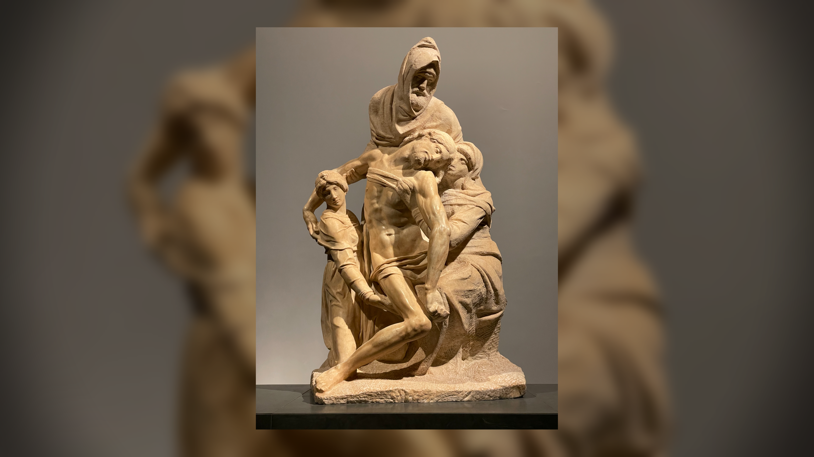
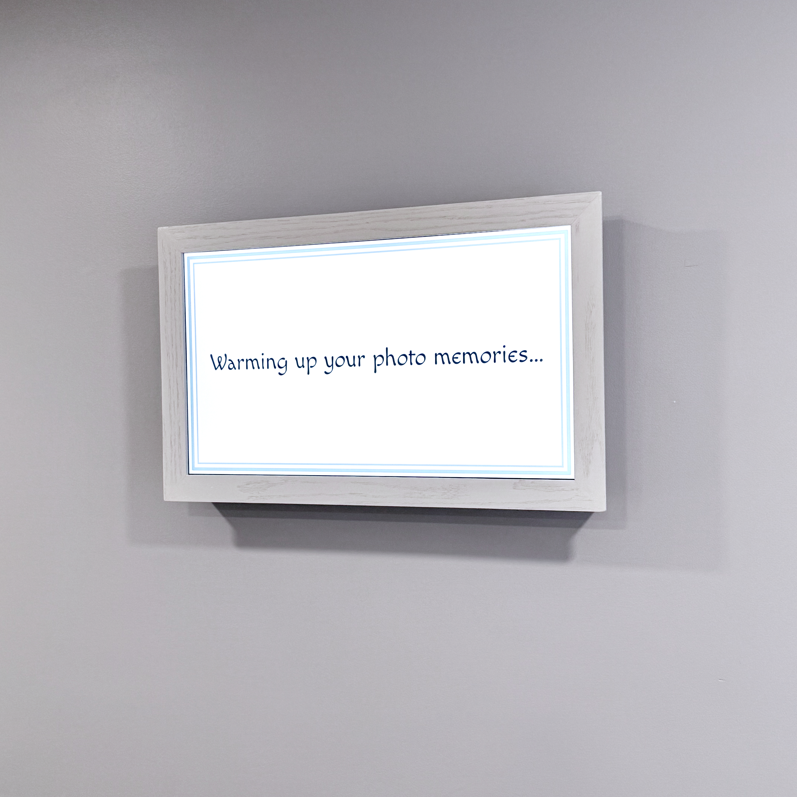

# A Build-vs-Buy Debate That Led To Writing Custom Software

> A Digital Picture Frame Built with Rust and AI

---

## Search for a Digital Picture Frame

There is a 27-inch 4K photo frame on my mother-in-law's wall, cycling slowly through grandkids, family gatherings, travel snapshots, and a handful of old scans. I made it myself — and the story of how it got there is, in large part, a story about software.

Rewind to the previous fall. We wanted to give her a special gift. She loves photos, but her walls and furniture are already covered in framed photos. A digital picture frame was a great solution — many photos, single physical frame. I wanted something **large**, and something **high resolution**.

The commercial landscape has some genuinely interesting options. Large E Ink panels exist and are beautiful — but the large ones I found were running around **$1,900**. Many LCD frames are either small or limited to **1920×1080** full HD. There's at least one subscription-free option I genuinely appreciated for its business model, but its top resolution is **1600×1200**. Nothing I found was simultaneously large, true 4K (3840×2160), and free of ongoing strings.

I want to be fair about subscriptions. There are long-term costs to software development and maintenance; cloud infrastructure isn't free; a well-maintained service is often worth paying for. Sometimes a subscription makes complete sense and is worth every dollar. But it's yet another monthly bill, and when the alternative is a fun maker project, building won over buying.

As a maker at heart, I'm always wondering, "How can I make that myself?" I also knew I wanted one for our own home — which meant any commercial price I was willing to pay was effectively doubled.

Starting a new make is fun and a digital picture frame presented several main items to figure out. Choose hardware, build a frame, plan the wall installation, and write software. The combination of the inherent challenge and the opportunity to learn through a recreational project led me to explore writing my own software. A new software project starts with choosing a language.


_The finished frame: a 4K panel in a wooden surround._

---

## Why Rust

I had a software design in mind early: a **pipeline of independent stages** passing images along — one stage watching the filesystem for new photos, another managing the queue, another decoding and loading, another applying the mat and effects, the last one rendering to the screen. Each stage consuming items from earlier stages and producing new items for the next stage.

Python3 would absolutely work. But in the last few years I was gaining significant experience with Rust mainly for scientific computing, which complemented twenty-plus years of C expertise. It took some time for me to warm up to Rust, but now I appreciate its rich crate infrastructure and language features. Photo frame software was a perfect recreational project to test Rust in a new setting.

What Rust bought, in practical terms: predictable memory on a small computer; no garbage-collector pauses to hitch a transition mid-fade; safe concurrency for the pipeline; and a single self-contained binary.

The crate ecosystem made each pipeline stage concrete. **tokio** runs the async tasks; **wgpu** drives the GPU transitions on Wayland; **image** and **jpeg-decoder** handle photo decoding; **axum** and **qrcode** together power the Wi-Fi recovery web page; **swayipc** controls the on-screen overlay. If you want the full details, see the [rust-photo-frame](https://github.com/vincentl/rust-photo-frame) git repo.


_Image Pipeline Design._

---

## The build: a Pi, a monitor, and a frame

The core parts were a Dell S2725QC 27-inch 4K monitor and a Raspberry Pi 5 with 4 GB of RAM.

A nice feature of the monitor is a 65 watt USB-C upstream port that can power the Raspberry Pi, eliminating the need for a separate Pi power supply. The whole assembly could live on a single wall cord. Making this work required a power HAT for the Pi. I spent time reading reviews, unsure whether the Dell's USB-C delivery and the HAT's requirements were compatible. Once I had the Pi 5, active cooler, and HAT assembled, I plugged it in and it just worked.

Since the Pi was going to live inside a wooden box next to a monitor, the active cooler was a must.

A lot of photo-frame builds strip the monitor down to bare panel and board — cleaner, slimmer option. I didn't. The reason was **warranty and risk**: I didn't want to immediately void a new monitor warranty, and I didn't want to snap a connector or solder joint I couldn't easily fix. I also didn't know whether parts of the monitor — power supply circuitry, voltage rails — required handling I didn't understand.

I deliberately wanted **no physical mat**. Commercial frames with physical mats look great with the right photo, but they constrain aspect ratio. I wanted to support any photo — landscape, portrait, square, old 3:2 scans — and let the software handle the matting. The hardware is a clean, understated wooden surround and nothing more.

The physical assembly was a shadow box with a French cleat to hang everything flat against the wall. The [build doc](https://github.com/vincentl/rust-photo-frame/blob/main/docs/build.md) covers the full how-to. One word of caution if you make your own: you're combining risks from heat, electric, and a heavy panel hung on a wall — understand these risks, work carefully, ensure your final installation is safe.



_Wall mounted monitor without and with wooden frame_

### Cost

Parts for one frame came to about **\$542 at September–October 2025 prices**. I happened to buy just before the AI-driven memory and chip squeeze hit hard, so the same frame would run roughly **\$665 today**. Almost the entire increase is silicon:

| Big-ticket part             | Then (2025) | Now (2026) | Change |
| --------------------------- | ----------- | ---------- | ------ |
| Dell S2725QC 27″ 4K monitor | $289.98     | $329.99    | +14%   |
| Raspberry Pi 5 (4 GB)       | $65.87      | $130.00    | +97%   |
| SanDisk 128 GB microSD      | $16.82      | $37.99     | +126%  |
| GeeekPi cooler + power HAT  | $41.98      | $41.98     | —      |

The Pi nearly doubled; the microSD more than doubled. The monitor barely moved, and the cooler and power board held flat. The rest — small parts (button, headers, standoffs, screws, acrylic for the Pi bracket) plus the wooden frame (birch ply, oak, poplar, glue, paint) — made up the balance, bought in quantities that covered two frames, since I wanted one for our home as well.

---

## Building it with AI

Let me say up front: AI-assisted coding is a genuinely divisive topic, and I'm not here to sell anyone on it. What I can do is tell you exactly how it went.

I started in VS Code with OpenAI Codex — I was already using it and kicking off tasks in the cloud was easy. After a few months of experience, I switched to Claude (Sonnet and Opus) to learn a different model family. I eventually settled into the Anthropic macOS app. The motivation throughout was learning the art-of-the-possible.

### An experiment that worked

A real test was the `studio` mat — the one that ships in v1.0 with museum-board matting, a 45-degree bevel, and a linen-weave texture. I found an article on [tileable cloth shading](https://www.mikecauchiart.com/single-post/2017/01/23/research-tillable-images-and-cloth-shading) and pointed Codex at it. It was an experiment with low expectations.

The first implementation nearly nailed a linen weave — only rotated about 15 degrees off the expected horizontal/vertical threads parallel to the monitor edges. One prompt fixed it. It was amazing and exciting.

Print-simulation effects came the same way, from a [paper on soft proofing](https://repository.rit.edu/cgi/viewcontent.cgi?article=1159&context=other) out of RIT. Both features ship in v1.0.


_The studio mat — museum board, a 45° bevel, and a linen weave (shown magnified)._

### An experiment that fought back

The grind was **Wi-Fi recovery** and the **kiosk display stack** — the piece that lets a non-technical household reconnect the frame to Wi-Fi without ever touching a terminal.

On a single day in November 2025, I made **five commits all named "wifi debug."** I was going in circles. The recovery hotspot's password, the IP the portal bound to, the QR code shown on screen, and the on-screen overlay all had to agree with each other — and fixing one kept knocking another out of sync. A literal A→B→C→A loop. Months later, a single day in February 2026 took **six commits** just to make the password, IP, overlay, and QR consistent.

And the going-in-circles shape wasn't unique to Wi-Fi. Count the AI-generated commit subjects, and the whole project's retry-grind is evident:

```bash
$ git log --pretty='%s' | sort | uniq -c | sort -rn | head
   9 iris tuning
   8 iris polishing
   6 WIP: Greeting screen should appear
   5 wifi debug
   3 polish buttond
   3 WIP: wifi-manager
   3 WIP: debug greeting screen
   2 wifi manager
   2 reorganizing documentation
   2 removed unneeded directive
```

The five `wifi debug` commits didn't even crack the top three. The iris transition alone got "tuned" nine times and "polished" eight more (and still didn't make the v1.0 release — though it finally shipped in one more marathon session); a greeting screen was committed six times under the hopeful title _"should appear"_ — before it actually did.

What broke the loop wasn't more patches — it was a stronger model and changing how I prompted.

### Learning to prompt

> **Take a step back, consider the problem, and propose the right fix even if it means significant code changes.**

That kind of prompt turned the Wi-Fi mess from endless patches into an app-handoff recovery state machine and improved the slideshow randomization algorithm to avoid clumpy repeats with a **weighted-timeline scheduler**.

I think of prompting as a conversation — capturing intent plus guardrails that express my expectations. I am willing to accept working-but-inelegant code if the overall construct isn't a hack. The goal is to maintain momentum.

Here's the honest verdict: time to v1.0 probably wasn't much shorter than working solo. I know Linux well, but nothing about Raspberry Pi OS internals, GPU rendering pipelines, or building Linux services from scratch. I could have searched and learned what I needed — but with AI collaboration, learning _and_ doing felt easier and more complete. There are features I'm confident I wouldn't have had time to build alone: the full slate of mats and transitions, for instance. The AI proposed styles; I chose the ones I liked; it implemented them. But what AI was really doing was keeping me in the part I love: thinking. It helps me stay focused on ideation, which is usually interrupted by implementation.

Nine months after the first commit, it's been on a wall doing its job since her birthday.

---

## Living with it — and a note on how this was written

I worked to an October 2025 birthday deadline to get a working minimum viable frame. She absolutely loves it — mentions it whenever we meet. Extended family and visitors call it a mesmerizing conversation piece.

I tend the frame remotely over **Tailscale**. I've updated it twice since giving it: once during a visit, once entirely from home without setting foot near the device. And if the Wi-Fi ever drops — all those debug commits for something — the frame raises its **own hotspot and puts a QR code on screen**. Scan it, enter the new credentials, and it rejoins the network without any help from me. The single hardest thing to build turned out to be the feature a non-technical household actually _feels_.

One small touch from the scheduling algorithm: when I load a new batch of photos, they play more often, on average, than the older photos, so she sees them quickly. For her, it is fun and exciting to see all the new photos while keeping the surprise of rotation over time. It doesn't guarantee every photo appears in a short window, but it helps.

Photo slideshows feel polished with good transitions between photos. The frame ships **nine transitions** — cross-fades, a gentle Ken-Burns zoom, an e-ink-style flash, slat and radial reveals, and the hard-won mechanical camera iris — and **nine mats**, from a museum-board studio mat to a soft drop shadow to a blurred, Apple-TV-aerial backdrop. I run them all; I genuinely like every one.


_The cinematic-blur mat: the photo floats over a blurred, enlarged copy of itself — the "Apple-TV-aerial" look._

<video src="https://github.com/user-attachments/assets/940f1d2a-24ae-4d5d-b931-aeda3353b45f" controls="controls" style="max-width: 730px;">
</video>

_Transition & Matting Showcase with Captions_

The showcase mode cycles through a small set of photos and each transition and mat. Since each transition and mat has configuration options, the showcase can't demonstrate everything, but hopefully it gives an interesting sampling.


_Waking up for the day_

The software is [open source under the MIT license](https://github.com/vincentl/rust-photo-frame) so you can build your own.

> _A note on how this story was written and how the software was written. Both were created with heavy AI assistance — the repo carries a full AI statement if you want the specifics. I start with a terse brain dump in an attempt to not lose any of the disorganized ideas floating around in my mind. Then lean on AI to organize the thoughts, expand terse notes into coherent text or code, track ideas that could easily slip away, cross-check content, and generally act as an eager collaborator._

---

_About the author — Maker / Mathematician / Pizza Enthusiast; 20+ years in C, a few years of Rust; builds things to create & learn_
